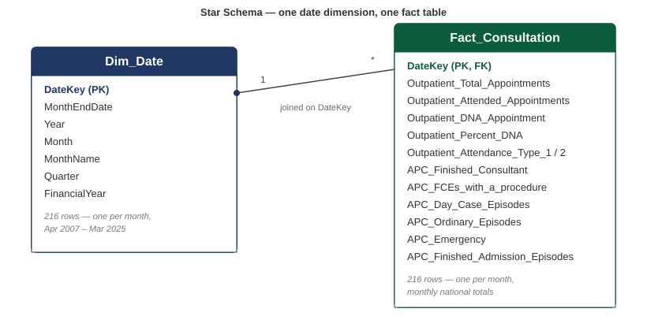
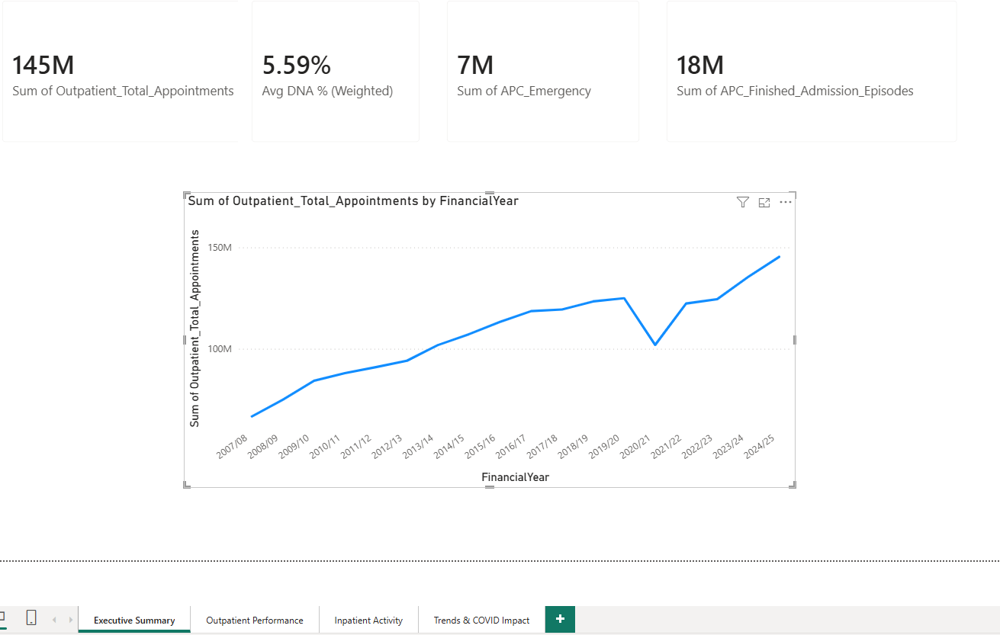
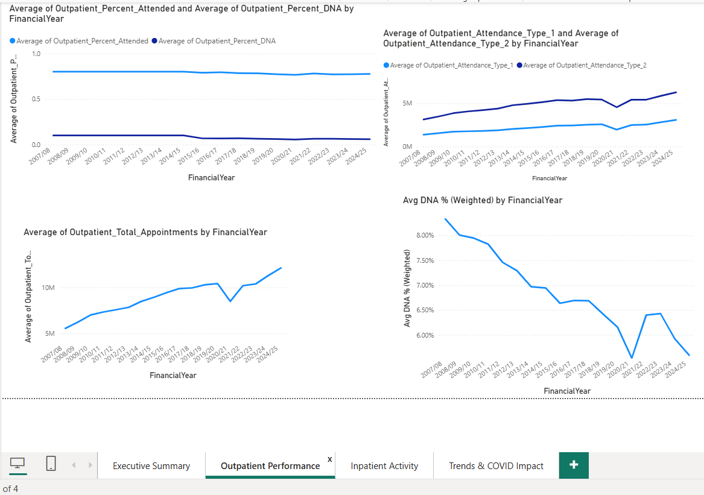
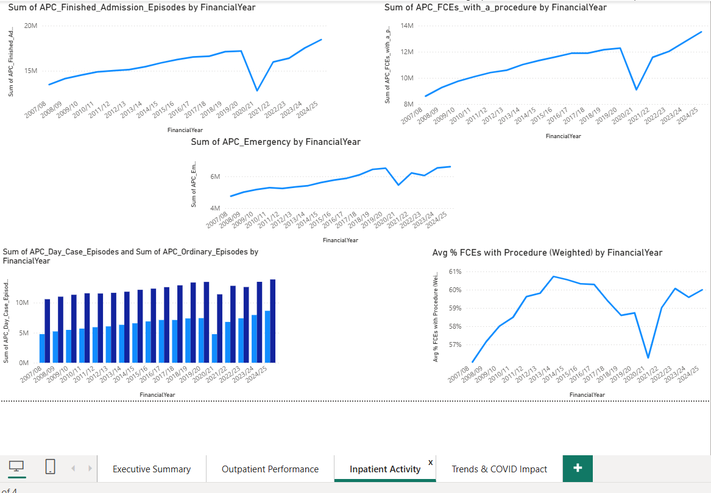
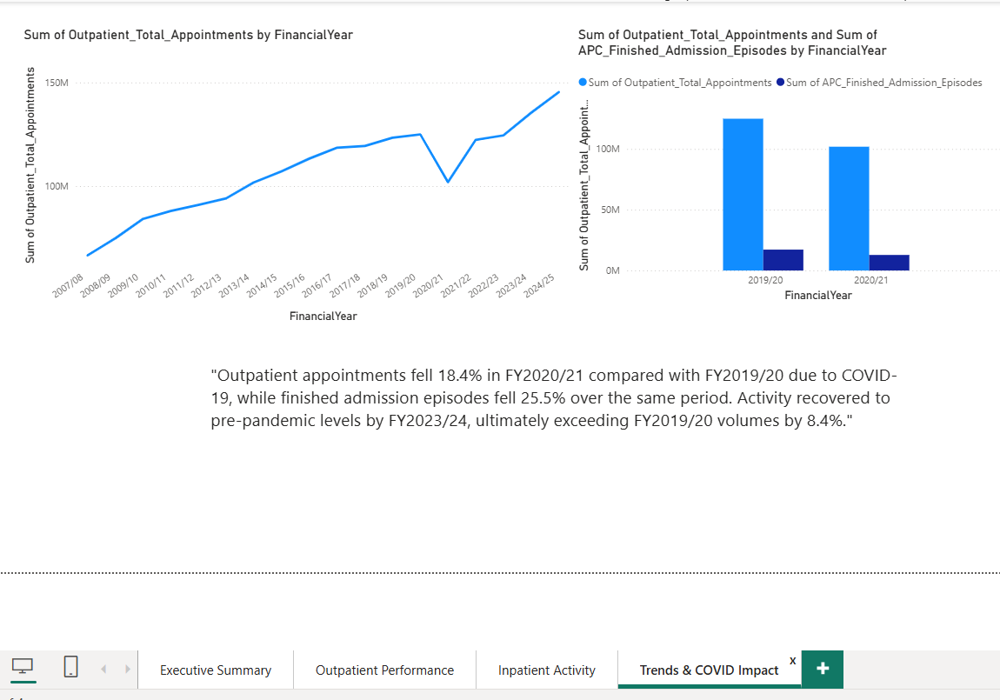

# NHS Hospital Activity Dashboard

A portfolio data analytics project analysing NHS England hospital activity
(outpatient and inpatient) from **2007 to 2025**, built with SQL Server and Power BI.

## 🎯 Project Goal
Turn monthly NHS hospital activity statistics into a clean SQL database and an
interactive Power BI dashboard, tracking outpatient attendance, DNA (Did Not
Attend) rates, and emergency/inpatient admissions over time — including the
COVID-19 impact and recovery.

## 🗂️ Data Source
NHS Hospital Episode Statistics (HES) — Admitted Patient Care and
Outpatients activity, monthly national totals, April 2007 – March 2025.

Sourced via [NHS Open Dataset: Hospital Episode Statistics](https://www.kaggle.com/datasets/fungainicolechirombe/nhs-free-dataset-for-analysis)
(Kaggle), originally published by [NHS Digital](https://digital.nhs.uk/services/hospital-episode-statistics),
licensed under the [Open Government Licence v3.0](https://www.nationalarchives.gov.uk/doc/open-government-licence/version/3/).

**Note:** the raw and cleaned data files are not committed to this repository
(they're freely available under OGL v3.0 from the link above, and there's no
need to re-host them here — see [`Data/README.md`](Data/README.md) for full
source details and how to obtain and regenerate them locally). Full
column-level documentation is in
[`Documentation/Data_Dictionary.md`](Documentation/Data_Dictionary.md).

## 🛠️ Tools Used
- **SQL Server / SSMS** — data storage and querying
- **Python (pandas)** — data cleaning
- **Power BI Desktop** — visualisation
- **Git / GitHub** — version control and portfolio hosting

## 📁 Project Structure
```
NHS_Hospital_Activity_Dashboard/
├── Data/                   Raw and cleaned data files
├── Scripts/                Python cleaning script
├── SQL/                    Database creation, table creation, import scripts
│   └── Queries/            12 portfolio analysis queries
├── PowerBI/                Power BI .pbix file (added after Friday/Saturday build)
├── Documentation/          Data dictionary & KPI definitions
├── Screenshots/            Dashboard screenshots
└── README.md
```

## 🗄️ Schema


A simple star schema: one date dimension joined to one fact table on
`DateKey`. Kept deliberately simple for this dataset's size — see
[`PROJECT_DOCUMENTATION.md`](Documentation/PROJECT_DOCUMENTATION.md)
for the reasoning behind this design choice.

## 🚀 How to Reproduce
1. Download the source data and save as `Data/Consultation.csv` — see [`Data/README.md`](Data/README.md) for the exact source link and instructions
2. Run `Scripts/01_clean_and_prepare_data.py` to generate `Dim_Date.csv` and `Fact_Consultation.csv`
3. In SSMS, run in order:
   - `SQL/01_create_database.sql`
   - `SQL/02_create_tables.sql`
   - `SQL/03_import_data.sql` (or use the Import Flat File wizard as noted inside the script)
4. Run the analysis queries in `SQL/Queries/`
5. Open Power BI Desktop → Get Data → SQL Server → connect to `NHS_Hospital_Activity`
6. Build the visuals (see `Documentation/KPI_Definitions.md` for what goes on each page)

## 📊 Dashboard Pages
1. **Executive Summary** — headline KPIs for the latest financial year
   (FY2024/25): total appointments, DNA %, emergency admissions, finished
   admission episodes — plus the full 18-year trend for context
2. **Outpatient Performance** — attendance and DNA % trends, first vs.
   follow-up attendance
3. **Inpatient Activity** — finished episodes, procedures performed, day
   cases, emergency admissions
4. **Trends & COVID Impact** — full 18-year trend, FY2019/20 vs FY2020/21
   comparison, and a written summary of the key findings

## 📷 Screenshots

**Executive Summary** — headline KPIs (FY2024/25) plus the full 18-year
appointments trend for context.


**Outpatient Performance** — attendance and DNA rate trends, first vs.
follow-up attendance split, and total appointments over time.


**Inpatient Activity** — finished admission episodes, procedures
performed, emergency admissions, and day case vs. ordinary episode volumes.


**Trends & COVID Impact** — the full 18-year trend alongside a direct
FY2019/20 vs FY2020/21 comparison, with a written summary of the findings.


## 📌 Key Findings
- **COVID-19 impact:** outpatient appointments fell **18.4%** in FY2020/21
  compared with FY2019/20, while finished admission episodes fell more
  sharply, by **25.5%** — likely reflecting that elective/planned
  admissions were cancelled more aggressively than outpatient care, some
  of which shifted to phone/video consultation instead.
- **Recovery:** activity did not return to pre-pandemic volume until
  **FY2023/24**, which finished 8.4% above FY2019/20 levels. FY2022/23 was
  essentially flat with pre-pandemic volume (99.6%), showing recovery was
  gradual rather than immediate.
- **DNA (missed appointment) rate:** fell steadily from ~8.4% (FY2007/08)
  to ~5.5–6% in recent years — an 18-year improvement trend, with a
  temporary additional dip during the COVID period.
- **Follow-up vs first attendances:** follow-up attendances consistently
  exceed first attendances, consistent with NHS outpatient activity being
  dominated by ongoing management of long-term conditions rather than
  one-off consultations.
- See [`Documentation/Insights_Log.md`](Documentation/Insights_Log.md) for
  the full reasoning behind each finding, including one hypothesis
  (Day Case overtaking Ordinary episodes) that the data did not support.

## 🔍 Data Insights Log
Beyond the dashboard itself, [`Documentation/Insights_Log.md`](Documentation/Insights_Log.md)


